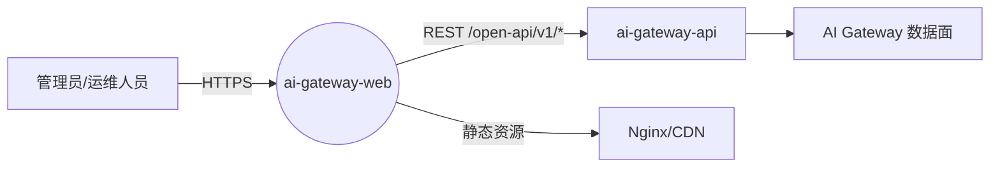

# AI Gateway Web 总体设计文档

## 1. 项目定位与目标

`ai-gateway-web` 是 AI 网关的图形化管理控制台（Web Console），面向运维人员和管理员，提供对 AI 网关核心资源的可视化配置与查看能力。前端不保存业务状态，仅作为后端 `ai-gateway-api` OpenAPI 的消费方，通过 REST 接口完成所有持久化操作。

核心功能覆盖：

- **资源管理**：AI 网关实例池、AI 业务集群（Cluster）、模型定价（Model Prices）。
- **路由管理**：路由表（Global / Entity / API-Key），规则支持加权 `targets` 与 `fallbacks`。
- **消费者管理**：API Key、Entity（服务实体），配额单位支持 `total_token` 与 `RMB`。
- **用户管理**：登录用户、Token 管理。
- **证书管理**：TLS 证书上传、全局默认证书切换。
- **操作日志**：操作审计日志查询与详情查看（只读）。

## 2. 技术栈

| 层级 | 技术/库 | 说明 |
|------|--------|------|
| 框架 | Vue 2.6 | 单页应用核心框架，采用 Options API 组织组件。 |
| 路由 | vue-router 3.x | `history` 模式，`require.ensure` 按路由代码分割。 |
| 组件库 | iView 3.x | 主导航、菜单、表单、表格、抽屉、步骤条等。 |
| 组件库 | Element UI 2.x | 补充使用图标、分页、选择器、按钮等。 |
| 国际化 | vue-i18n 8.x | 支持中/英双语，按语言包异步加载。 |
| 网络 | axios | 统一封装请求拦截器、响应拦截器、错误提示。 |
| 状态 | Vue.observable + localStorage | 轻量级全局状态，存储用户会话与导航元数据。 |
| 构建 | Webpack 5 + Babel | 自定义 dev server、proxy、构建脚本。 |
| 样式 | Less | 主题覆盖、全局样式、组件局部样式。 |
| 工具 | lodash、moment、uuid、validator | 数据处理、格式化、校验等。 |

## 3. 目录结构

```
ai-gateway-web/
├── configs/                  # webpack 与 dev server 配置
├── design-docs/              # 设计文档（本目录）
├── docs/                     # 用户/部署/开发文档
├── src/
│   ├── assets/               # 样式、字体、图标
│   ├── components/           # 通用组件（跨模块复用）
│   ├── i18n/                 # 国际化语言包（en.js、zh.js）
│   ├── layout/               # 布局框架（侧边栏、顶部栏、面包屑）
│   ├── modules/              # 业务模块（按功能域划分）
│   ├── router/               # 路由配置与实例
│   ├── utils/                # 工具、请求、状态、鉴权、指令
│   ├── main.js               # 应用入口
│   └── App.vue（由 layout.vue 作为根组件渲染）
├── index.html                # 页面模板
├── package.json
└── README.md
```

## 4. 分层架构

前端整体采用**四层结构**：展示层、业务层、公共能力层、接口层。

```
┌────────────────────────────────────────────────────────────┐
│                      展示层（View）                         │
│  layout.vue / sidebar / headerBar / breadCrumb / 404       │
│  modules/**/index.vue（列表页）                              │
│  modules/**/components/*.vue（表单、详情、步骤组件）           │
├────────────────────────────────────────────────────────────┤
│                      业务层（Business）                      │
│  模块内部状态 / 表单校验 / 数据转换 / 子组件编排             │
│  例如：Cluster 向导步骤组件；Providers 复用 InstancePool 维护实例池 │
├────────────────────────────────────────────────────────────┤
│                      公共能力层（Common）                    │
│  通用组件：pageTable、CustomModal、Expression               │
│  工具：i18n、store、authorize、tool、const、model            │
│  指令：directive.js                                         │
├────────────────────────────────────────────────────────────┤
│                      接口层（API）                           │
│  utils/request.js（axios 封装、统一前缀、鉴权、错误处理）      │
│  backend: ai-gateway-api /open-api/v1/*                       │
└────────────────────────────────────────────────────────────┘
```

### 4.1 展示层

由 `src/layout/layout.vue` 作为根组件，内部组合：

- `sidebar`：左侧固定导航，渲染菜单树。
- `headerBar`：顶部栏，提供菜单展开/收起控制。
- `breadCrumb`：面包屑导航。
- `router-view`：内容区，渲染当前业务模块页面。

登录页（`LoginPassword`）独立渲染，不显示上述布局。

### 4.2 业务层

按功能域划分为多个 `module`，每个模块独立维护：

- 列表页：列表 + 搜索/操作按钮 + 分页。
- 编辑/新建：通常使用 `Drawer` 抽屉，内部由多个步骤组件或表单组件组成。
- 详情页：使用 `Review` 组件聚合展示子模块数据。

例如 `modules/Clusters`：

- `index.vue`：列表页，负责拉取集群列表、打开编辑/详情抽屉。
- `components/index.vue`：新建/编辑**五步**向导容器，组合 `BaseConfig`、`Timeout`、`PassiveHealthCheck`、`GatewayConfig`、`Review`（实例池在 `modules/Providers` 维护）。
- `components/Review.vue`：详情/复核组件，只读展示。

### 4.3 公共能力层

- `src/components/`：跨模块复用的通用组件。
  - `pageTable`：统一表格封装，支持排序、搜索、加载状态。
  - `CustomModal`：统一弹窗封装。
  - `Expression`：条件表达式可视化组件。
- `src/utils/`：工具函数与全局服务。
  - `request.js`：HTTP 客户端。
  - `store.js`：轻量状态管理。
  - `authorize.js`：登录态与权限校验。
  - `i18n.js`：国际化初始化与语言切换。
  - `tool.js`：URL 格式化、通用工具函数。
  - `const.js`：常量集合。
  - `model.js`：数据模型/转换函数。
  - `directive.js`：自定义 Vue 指令。

### 4.4 接口层

`utils/request.js` 基于 axios 封装：

- 统一请求前缀：`${window.location.protocol}//${window.location.host}/open-api/v1/`。
- 自动注入 `Content-Type`、`X-Fe-Request-Id`、`Accept-Language`、`Authorization: Session <sessionKey>`。
- 全局错误处理：网络失败、401/402 跳转登录、后端错误提示。
- 支持 `unneedTips`（静默错误）和 `withoutAuth`（无需鉴权）配置。

## 4.5 架构总览图



前端基于 Vue 2 + iView/Element UI 构建，按“展示层 → 业务模块 → 公共能力 → 接口层”分层。路由守卫负责鉴权与语言包加载，业务模块通过通用组件、公共工具与 `ai-gateway-api` 交互完成数据管理。

## 5. 路由与导航设计

### 5.1 路由配置

路由定义在 `src/router/router.js`，使用 `require.ensure` 进行代码分割：

- `/login`：`LoginPassword`（登录页）。
- `/`：`BaseView` 作为布局容器，重定向到首页，子路由为各业务模块：
  - `product.home`：首页。
  - `AIGatewayInstancePool.list`：AI 实例池。
  - `user.list`：用户管理。
  - `Provider.list`：模型服务商。
  - `AICluster.list`：AI 业务集群。
  - `AdvanceRouteRule.list`：路由表（`/route-tables`）。
  - `APIKey.list`：API Key 管理。
  - `Entity.list`：Entity 管理。
  - `ModelPrice.list`：模型定价。
  - `certs.list`：证书管理（`/cert`）。
  - `OperationLog.list`：操作日志（`/operation-logs`）。
- `*`：404 页面。

路由模式为 `history`，由 `connect-history-api-fallback` 在 dev server 中支持。

### 5.2 导航菜单

菜单数据来自后端 `meta` 接口（`utils/authorize.js` 在路由守卫中拉取），由 `store.getNavRoot()` 返回树形结构，递归渲染在 `sidebarNav.vue` 中。

菜单项与路由 `name` 绑定，点击后通过 `this.$router.push({ name })` 跳转。当前激活项由 `$route.name` 驱动。

## 6. 权限与状态管理

### 6.1 状态管理

采用 `Vue.observable` + 纯对象 store（`src/utils/store.js`），主要状态：

- `user`：当前登录用户（`name`、`sessionKey`、`is_admin`），持久化到 `localStorage`。
- `meta`：后端返回的导航元数据。

提供方法：

- `getUser / setUserData / removeUserData`：用户会话管理。
- `getMeta / setMeta`：导航元数据管理。
- `getNavRoot / findNav`：导航树读取与路由匹配。

### 6.2 路由守卫与权限

`src/main.js` 中注册 `router.beforeEach`：

1. 启动 `NProgress`。
2. 异步加载当前语言包。
3. 调用 `checkRole(to)` 进行鉴权：
   - 未登录 → 跳转登录页。
   - 非管理员 → 提示非法访问。
   - 目标路由不在导航树中 → 跳转登录页。
   - 通过 → 继续导航。

`authorize.js` 首次会请求 `meta` 接口获取导航，并缓存到 `store`。

## 7. 国际化设计

国际化基于 `vue-i18n`：

- 语言包：`src/i18n/en.js`、`src/i18n/zh.js`。
- 默认语言：`localStorage.lang` 或 `'en'`。
- iView 与 Element UI 组件语言分别合并到各自 locale 中。
- 路由守卫中调用 `loadLanguageAsync(lang)`，确保进入页面前语言包已加载。

所有界面文本通过 `$t('key')` 或 `i18n.t('key')` 获取，避免硬编码。

## 8. 组件复用体系

组件分为两类：

### 8.1 通用组件（src/components）

| 组件 | 职责 |
|------|------|
| `pageTable` | 统一表格：数据、列配置、加载、排序、搜索；支持客户端分页与服务端分页。 |
| `CustomModal` | 统一弹窗封装。 |
| `Expression` | 路由规则中的条件表达式可视化编辑（含 `req_body_json_prefix_in` 等源语）。 |

### 8.2 业务组件（modules/**/components）

每个模块内部组件按职责拆分：

- 列表容器（`index.vue`）。
- 编辑向导容器（`components/index.vue`）。
- 子表单组件（如 `BaseConfig`、`Timeout`、`GatewayConfig`）；`InstancePool.vue` 位于 Clusters 目录供 Providers 嵌入。
- 详情/复核组件（`Review.vue`）。
- 弹窗组件（`Upsert.vue`、`Create.vue`、`ApiKeyView.vue` 等）。

模块内组件通过 `props` 向下传数据，通过 `$emit` 向上提交事件，保持父子单向数据流。

## 8.3 组件接口契约与数据流规范

### 8.3.1 通用组件接口契约

#### `pageTable`（`src/components/table/pageTable.vue`）

| Props | 类型 | 必填 | 说明 |
|-------|------|------|------|
| `columns` | `Array` | 是 | 列定义，支持 `title`、`key`、`sortable`、`searchable`、`searchType`、`searchFilters`、`searchValue`、`width`、`render` 等扩展字段。 |
| `tableData` | `Array` | 否 | 原始数据；未开启服务端分页时，组件内部完成分页、搜索、排序。 |
| `loading` | `Boolean` | 否 | 表格加载状态。 |
| `border` | `Boolean` | 否 | 是否显示边框，默认 `true`。 |
| `height` | `Number` | 否 | 表格高度。 |
| `currentPage` | `Number` | 否 | 当前页码，默认 `1`。 |
| `pageSize` | `Number` | 否 | 每页条数，默认 `20`。 |
| `pageSizes` | `Array` | 否 | 可选分页条数，默认 `[20, 30, 40, 50]`。 |
| `total` | `Number` | 否 | 服务端分页时的总条数。 |
| `serverPagination` | `Boolean` | 否 | 是否启用服务端分页，默认 `false`。开启后搜索/翻页通过事件交给父组件请求后端。 |
| `draggable` | `Boolean` | 否 | 是否支持行拖拽。 |

| Events | 参数 | 说明 |
|--------|------|------|
| `dragDrop` | `(startIndex, endIndex)` | 行拖拽结束，返回原始数组下标。 |
| `on-row-click` | `(row, index)` | 行点击事件。 |
| `on-page-change` | `{ page, pageSize }` | 服务端分页时页码或每页条数变化。 |
| `on-search-change` | `filters` | 服务端分页时搜索条件变化。 |
| `on-sort-change` | `sortInfo` | 服务端分页时排序变化。 |

#### `CustomModal`（`src/components/CustomModal/index.vue`）

| Props | 类型 | 必填 | 说明 |
|-------|------|------|------|
| `modal` | `Boolean` | 是 | 是否显示。 |
| `title` | `String` | 否 | 标题，为空时使用默认提示图标。 |
| `content` | `String` | 否 | 文本内容，支持 `\n` 换行。 |
| `okText` | `String` | 否 | 确认按钮文案。 |
| `cancelText` | `String` | 否 | 取消按钮文案。 |
| `loading` | `Boolean` | 否 | 确认按钮 loading 状态。 |
| `oneButton` | `Boolean` | 否 | 是否只显示确认按钮。 |
| `disableConfirm` | `Boolean` | 否 | 禁用确认按钮。 |
| `disableCancel` | `Boolean` | 否 | 禁用取消按钮。 |
| `width` | `String` | 否 | 弹窗宽度，默认 `30%`。 |

| Events | 说明 |
|--------|------|
| `onOk` | 点击确认按钮。 |
| `onCancel` | 点击取消按钮。 |

#### `Expression`（`src/components/Expression/index.vue`）

| Props | 类型 | 必填 | 说明 |
|-------|------|------|------|
| `expression` | `String` | 否 | 初始表达式。 |
| `vars` | `Array` | 否 | 可用变量列表，组件内部自动拼接 `$` 前缀。 |
| `type` | `String` | 否 | 表达式类型，默认 `controller`，可选 `connController`。 |

| Events | 参数 | 说明 |
|--------|------|------|
| `expressionChanged` | `{ expression, vars, errmsg }` | 表达式变更或后端校验后触发。 |

### 8.3.2 业务组件接口契约（以 Cluster 编辑向导为例）

#### 向导容器 `modules/Clusters/components/index.vue`

| Props | 类型 | 必填 | 说明 |
|-------|------|------|------|
| `currentCluster` | `Object` | 否 | 当前集群数据，编辑时传入。 |
| `clusterNames` | `Array` | 是 | 已有集群名称列表，用于新建时重名校验。 |
| `isAdd` | `Boolean` | 是 | 是否为新建模式。 |

| Events | 参数 | 说明 |
|--------|------|------|
| `submit` | 无 | 提交成功后通知父组件关闭抽屉并刷新列表。 |

#### 子表单组件（如 `BaseConfig`）

| Props | 类型 | 必填 | 说明 |
|-------|------|------|------|
| `baseConfigData` | `Object` | 是 | 表单初始数据。 |
| `isAdd` | `Boolean` | 是 | 是否为新建。 |
| `reportFlag` | `Boolean` | 是 | 父组件通过翻转该值触发子组件校验与提交。 |
| `clusterNames` | `Array` | 是 | 用于重名校验。 |

| Events | 参数 | 说明 |
|--------|------|------|
| `submitData` | `{ topic: 'baseConfigData', data: Object }` | 校验通过后提交该步骤数据。 |

### 8.3.3 父子组件通信规范

1. **数据向下传递**：父组件通过 `props` 将数据传入子组件，子组件不直接修改 `props`。
2. **事件向上传递**：子组件通过 `$emit` 通知父组件，父组件负责更新自身状态并重新下发 `props`。
3. **状态提升**：当多个子组件需要共享状态时，状态应提升到最近的公共父组件（如向导容器）。
4. **触发式提交**：向导类表单通过父组件翻转 `reportFlag` 触发子组件校验，避免子组件自行监听按钮点击。
5. **异步校验**：`Expression` 等组件内部调用后端校验接口，校验结果通过事件回传，由父组件决定是否允许提交。

### 8.3.4 跨层级通信规范

| 场景 | 推荐方式 | 禁用方式 |
|------|----------|----------|
| 父子组件 | `props` + `$emit` | 直接修改父组件数据、通过 `$parent` 调用方法。 |
| 兄弟组件 | 状态提升到共同父组件 | 全局事件总线（除 `NAVIGATION_CANCELLED` 等框架级事件）。 |
| 跨模块共享 | `store.js` | 直接引用其他模块内部组件。 |
| 框架级通知 | `this.$root.$emit` / `$root.$on`（如导航取消事件） | 任意组件直接操作 `router`。 |

### 8.3.5 请求生命周期规范

所有业务请求统一通过 `this.$request` 发起，遵循以下生命周期：

```
[UI 触发] → [设置 loading] → [this.$request] → [接口层注入鉴权/语言/TraceId]
                                            ↓
                              [后端响应] → [解析 data/ErrMsg]
                                            ↓
                              [status === 200] → [更新状态] → [关闭 loading] → [提示/刷新]
                              [status !== 200] → [request.js 统一错误提示] → [关闭 loading]
```

规范说明：

1. **loading 状态**：列表页由父组件控制 `pageTable.loading`；抽屉内按钮通过 `Button :loading` 控制。
2. **错误处理**：默认由 `request.js` 统一弹提示；如需静默处理，配置 `unneedTips: true`。
3. **鉴权失败**：401 自动清除用户数据并跳转登录；402 保持登录态但提示无权限。
4. **成功回调**：成功后应关闭弹窗/抽屉，并刷新受影响的数据列表，避免出现状态不一致。

## 9. 数据流与 API 调用

### 9.1 典型列表页数据流

1. 组件 `mounted` 调用 `getData()`。
2. 通过 `this.$request({ url, method })` 拉取后端数据。
3. 响应数据写入 `tableData`，表格渲染。
4. 操作列触发增删改查，请求成功后刷新列表或关闭抽屉。

### 9.2 典型编辑向导数据流（以 Cluster 为例）

1. 列表页打开 `Drawer`，传入当前行数据或空对象。
2. 向导容器 `components/index.vue` 按步骤显示不同子组件。
3. 每个子组件负责一部分表单，通过 `reportFlag` 触发校验，校验通过后 `$emit('submitData')` 提交数据给父组件。
4. 父组件合并各步骤数据，最后一步 `Review` 聚合展示并提交到后端。
5. 后端返回成功后，关闭抽屉并刷新列表。

### 9.3 URL 参数格式化

使用 `utils/tool.js` 中的 `urlFormat` 处理 REST 路径参数，例如：

```js
this.$urlFormat('clusters/{cluster_name}', { cluster_name: row.name })
```

## 10. 安全与异常处理

### 10.1 鉴权

- 登录成功后保存 `sessionKey`。
- 后续请求自动携带 `Authorization: Session <sessionKey>`。
- 401 响应清除用户数据并跳转登录页。

### 10.2 错误提示

- 网络失败：全局 `Notice.error` 提示。
- 后端错误：解析 `ErrMsg`，按 `标题: 内容` 拆分展示。
- 静默错误：配置 `unneedTips` 或 `isSilent` 时不弹提示。

### 10.3 路由异常

`router.onError` 捕获 chunk 加载失败，自动重新导航到目标路径，提升代码分割后的容错能力。

## 11. 构建与部署

- 开发：`npm start` 启动自定义 dev server（`configs/dev-server.js`），支持代理后端 API。
- 构建：`npm run build` 执行 `configs/build.js`，输出静态资源。
- 代理：`configs/devProxy.js` 配置本地开发时后端接口转发。
- 代码规范：`npm run lint` 使用 ESLint + Prettier 检查并修复。

## 12. 设计约束与约定

1. **OpenAPI 只消费不定义**：前端不重复定义 OpenAPI 接口，所有接口依赖引用 `ai-gateway-api` 的设计文档。
2. **语言包集中管理**：界面文案全部走 `i18n`，不允许硬编码中文或英文。
3. **模块自治**：每个业务模块独立目录，内部组件、逻辑不外泄。
4. **单向数据流**：父子组件通过 `props` 和 `$emit` 通信，避免直接修改 props。
5. **状态轻量**：不使用 Vuex，复杂状态提升到模块容器或 `store`。
6. **UI 组件库双轨**：iView 为主，Element UI 补充图标、分页、选择器等。

## 13. 相关文档索引

| 文档 | 说明 |
|------|------|
| `模块设计文档.md` | 各业务模块详细设计。 |
| `路由与导航设计文档.md` | 路由表、菜单权限、导航树。 |
| `状态管理设计文档.md` | store、鉴权、会话。 |
| `国际化设计文档.md` | i18n 语言包与切换机制。 |
| `组件与复用设计文档.md` | 通用组件与业务组件规范。 |
| `OpenAPI消费接口映射.md` | 页面/组件与后端接口映射。 |
| `构建与部署设计文档.md` | webpack、proxy、构建流程。 |
| `api-define/OpenAPI接口定义/` | 前端消费的 OpenAPI 约定（按模块拆分）。 |
