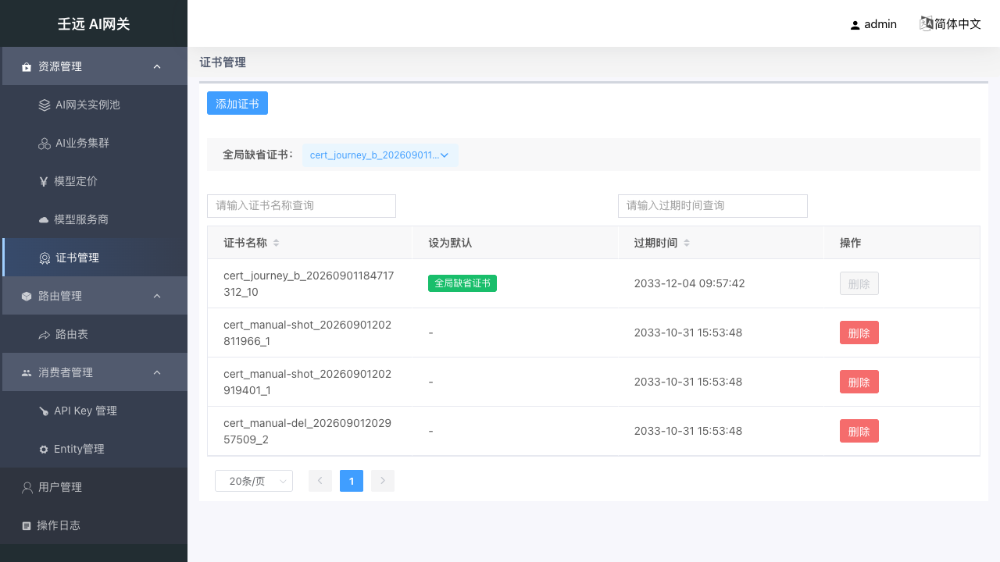
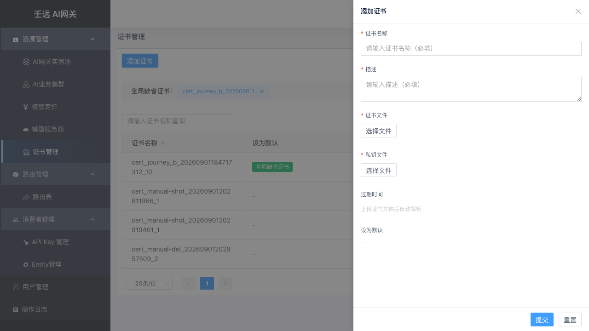
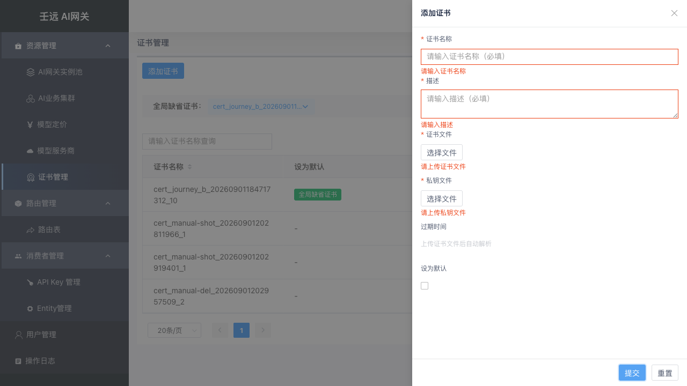
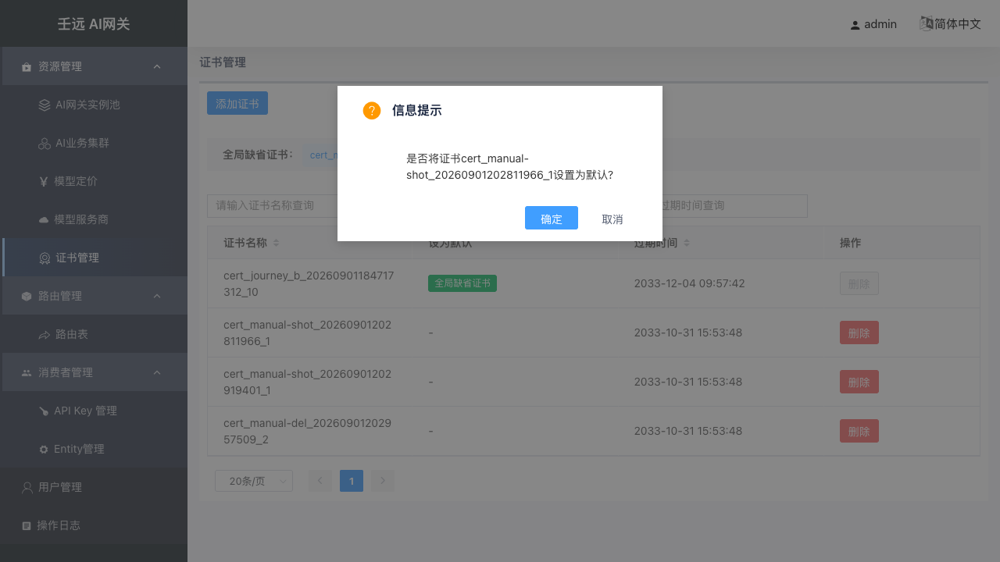
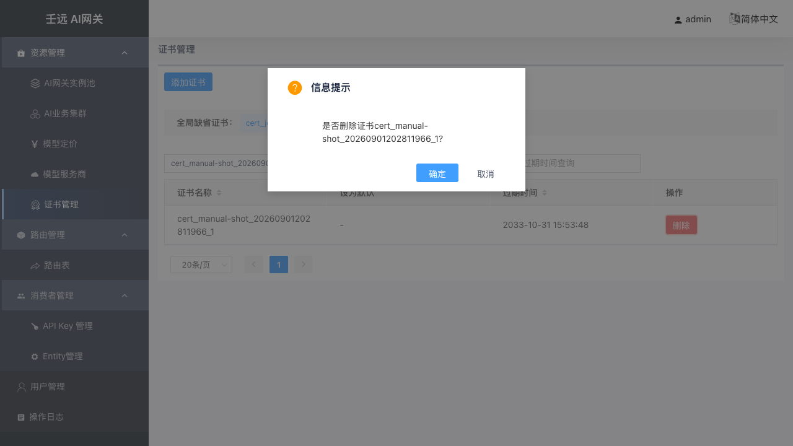

# 12 证书管理

本章覆盖 HTTPS 证书的上传、默认证书切换与删除。证书是数据面 HTTPS 接入的安全前置依赖，路由转发可引用已登记的证书。

**入口**：资源管理 → 证书管理（路径 `/cert`）。仅管理员可见。

## 12.1 列表页

列表展示证书名称、默认标识、过期时间与行操作。鼠标悬停证书名称可查看描述（Tooltip）。

页面顶部提供：

- **添加证书**：打开右侧创建抽屉；
- **全局缺省证书**：下拉选择当前默认证书，切换时需二次确认。

| 列 | 说明 |
| ------ | ------ |
| 证书名称 | 全局唯一标识；悬停显示描述 |
| 设为默认 | 默认证书显示「全局缺省证书」Tag |
| 过期时间 | 由服务端从证书文件解析，格式 `YYYY-MM-DD HH:mm:ss` |
| 操作 | 非默认证书可删除；默认证书删除按钮禁用 |

列表支持按**证书名称**、**过期时间**搜索。

## 12.2 添加证书

点击「添加证书」，在右侧抽屉填写表单并上传 PEM 文件：

| 字段 | 必填 | 说明 | 合法性 |
| ------ | ------ | ------ | ------ |
| 证书名称 | 是 | 全局唯一 | 2–64 字符；仅字母、数字、`_`、`-`、`.`；不能以 `_`、`-`、`.` 开头或结尾；不含空白 |
| 描述 | 是 | 用途说明 | 2–256 字符；不含控制字符 |
| 证书文件 | 是 | PEM 格式 X.509 证书 | 上传后展示文件名 |
| 私钥文件 | 是 | PEM 格式私钥 | 须与证书文件匹配 |
| 过期时间 | — | 只读预览 | 上传证书后前端自动解析首个 PEM 块；未上传时显示「上传证书文件后自动解析」 |
| 设为默认 | 是 | 是否设为全局默认 | 系统中尚无默认证书时自动勾选且不可取消 |

提交成功后右上角提示「证书添加成功!」，列表刷新。

必填项未填或格式不符时，字段下方出现红色校验提示：

## 12.3 切换默认证书

在列表顶部「全局缺省证书」下拉中选择目标证书，确认后将该证书设为默认，原默认证书自动变为非默认：

> 全局必须有且仅有一个默认证书。更新默认证书后，旧的默认证书可被删除。

## 12.4 删除证书

非默认证书行点击「删除」，在确认弹窗中确认后删除：

默认证书的删除按钮为禁用状态，悬停提示「默认证书不可删除」。

## 12.5 注意事项

- 过期时间由服务端从 `cert_file_content` 解析，创建请求**不提交**过期时间字段；
- 证书与私钥须为合法 PEM 格式且彼此匹配，否则提交失败；
- 证书名称全局唯一，重复名称会提示「数据重复」类错误。
